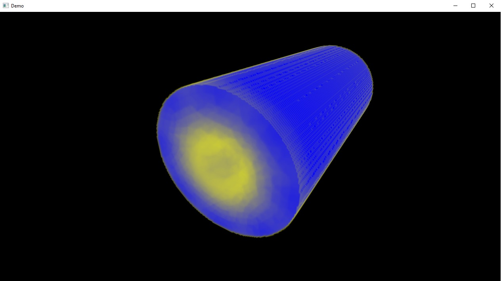
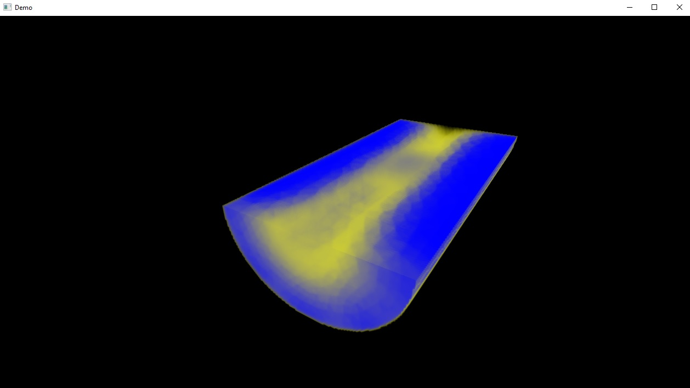
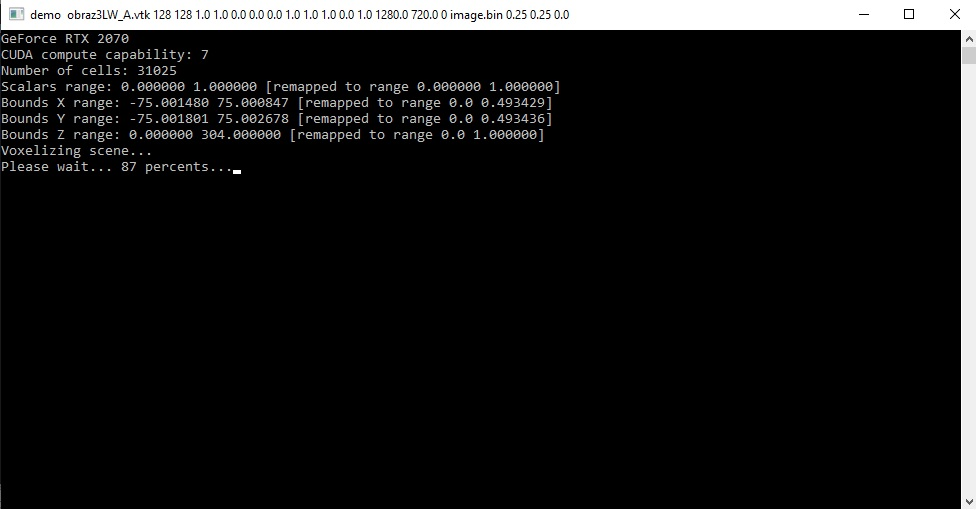

# Unstructured Tetrahedral Mesh Viewer.

Technologies:

CUDA - Convert mesh data into volume texture (brute force method).

OpenGL - Real time rendering (raymarching).

Compile with Visual Studio command line:
nvcc -o demo.exe demo.cu -lopengl32 -arch=sm_30  user32.lib gdi32.lib

Run executable with command line parameters. 

Pattern:

demo filename mapsize steps cminr cming cminb cmaxr cmaxg cmaxb intensity threshold crangemin crangemax resX resY mode bin offx offy offz

where:

filename - VTK file;

mapsize - (int) volume texture resolution;

steps - (int) raymarching iterator;

cminr cming cminb - RGB value for minimal scalar;

cmaxr cmaxg cmaxb - RGB value for maximum scalar;

intensity - transfer function intensity;

threshold - loop threshold (raymarching);

crangemin - minimum interpolator for scalars;

crangemax - maximum interpolator for scalars;

resX - screen width;

resY - screen height;

mode - mode (0) voxelize mesh and render, mode (1) load 3D texture from file, mode (2) save 3D texture to file;

bin - binary file (if active mode==1 or mode==2);

offx offy offz - voxel map offset after interpolation (in range 0-1).

Example usage: demo obraz3LW_A.vtk 128 128 0.0 0.0 1.0 0.1 0.0 0.0 1.0 1.0 0.0 1.0 1280.0 720.0 0 image.bin 0.25 0.25 0.0

Tested with NVCC version 9.0.176 and RTX 2070.

Key binding:

mouse - camera rotation;

WSAD - camera translation;

Bounds:

keys U I O P - decrease xmin, increase xmin, decrease xmax, increase xmax;

keys H J K L - decrease ymin, increase ymin, decrease ymax, increase ymax;

keys V B N M - decrease zmin, increase zmin, decrease zmax, increase zmax;

hold X - debug mode (blending off and show bounding box)

ESC - exit

